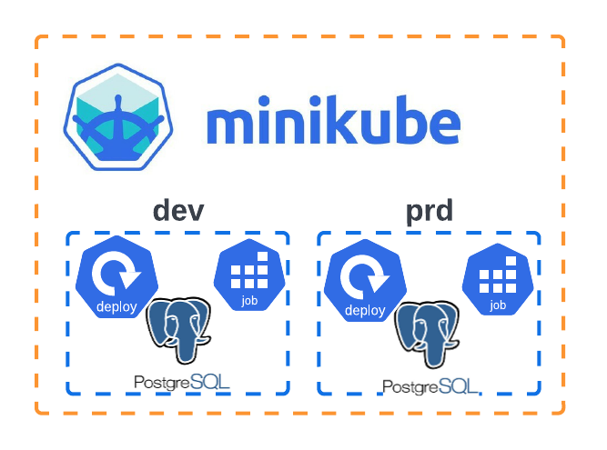
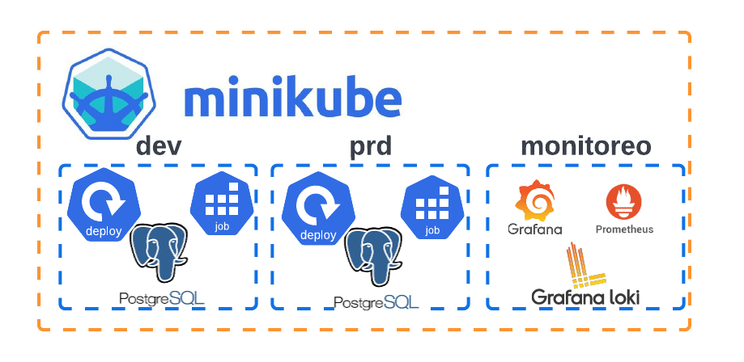
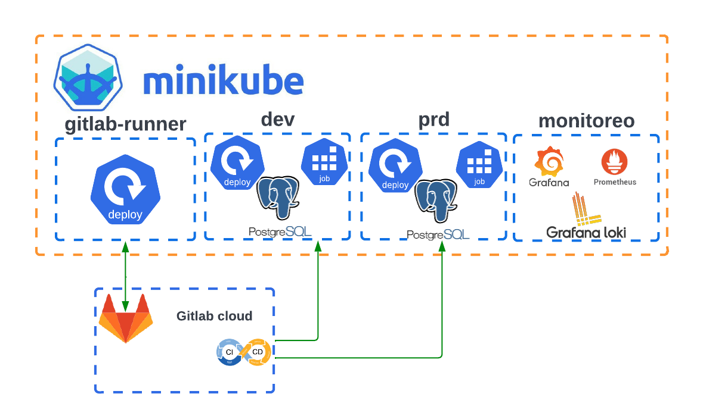
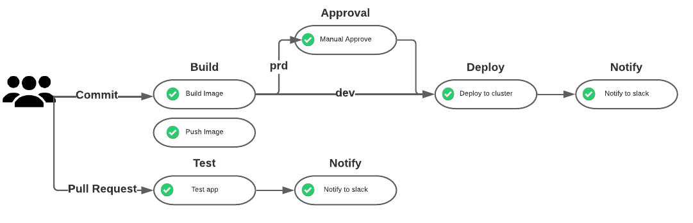

# Craftech Academy DevOps Junio 2022 Desafío Final

## **Introducción**:
El **desafío final** es una invitación a poner en práctica y desafiar los conocimientos sobre las herramientas tecnológicas y conceptos teóricos aprendidos durante estos meses.
En las clases vimos: Docker, Docker-compose, Kubernetes, Helm, CI/CD, Github Actions, Cloud.

## **Objetivos**:
- Utilizar todas las herramientas aprendidas durante el curso
- Proponer y llevar a cabo una solución general a la problemática
- Simular una situación real del ciclo de vida de una aplicación
- Crear y mantener entornos productivos y no productivos 
- Aprender a utilizar nuevas herramientas o plataformas
- Aprender a trabajar en comunidad para resolver dudas o problemáticas

## **Requerimiento:**
Un cliente nos pidió migrar su aplicación formada por dos servicios (**frontend** y **backend**) a un cluster de Kubernetes. 

El cliente desea que se pueda administrar el ciclo de las aplicaciones dentro del cluster de forma transparente y que además se pueda automatizar el deploy desde el repositorio.

## **Arquitectura del Cluster:**
Dentro del cluster se proponen dos **entornos**: uno no productivo (**dev**) y uno productivo (**prd**). Cada entorno debe ser creado y administrado de forma independiente 

Los servicios se van a administrar a partir de charts de Helm que van a tener todos los templates necesarios. Se pide agregar un template de tipo **job** que se encargue de realizar las migraciones a una base de datos PostgreSQL que va a ser parte del entorno.

## **Monitoreo:**
Dentro del cluster se propone un entorno de **monitoreo** donde se deployen las herramientas **Grafana**, **Prometheus** y **Loki** para tener dashboards de métricas y logs de la aplicación.

## **Repositorio y Runner:**
Como plataforma para versionar el código e implementar el CI/CD pipeline se va a utilizar **GitLab**, siguiendo la estrategia de branching por entornos.
Dentro del cluster se debe instalar un **runner** de GitLab, el cual se va a utilizar para correr los pipelines.

## **CICD:**
Se debe configurar un CI/CD pipeline en GitLab que implemente las siguientes stages básicos:
- Build de la imágen de Dockerfile
- Push de la imágen a DockerHub
- Deploy de la aplicación en minikube

Luego agregar:
- Test del código (pytest) cuando se realicen pull requests
- Stage de aprobación manual antes del deploy cuando el entorno al que se va a deployar es producción
- Notificación del resultado del pipeline por Slack

## **Diseño de la Arquitectura:**
Realizar un diseño gráfico de las herramientas y servicios que utilizarían si implementaran esta solución en una Cloud (AWS, GCP, Azure, etcétera).

## **Observaciones y recomendaciones:**
- La arquitectura de la aplicación está formada por dos servicios backend y frontend los cuales deberían tener su propio repositorio.
- Se puede realizar un docker-compose para probar local la aplicación en su conjunto.
- El backend tiene migraciones las cuales son necesarias para poder loggearse. El usuario es **admin** y la password **12345678**.
- Se puede deployar ingress para frontend, backend y monitoreo para poder utilizar una url configurada en */etc/hosts*.
- Cada servicio debe tener su dockerfile.

## **Links:**
- [Install Minikube](https://k8s-docs.netlify.app/en/docs/tasks/tools/install-minikube/)
- [Install Postgresql](https://github.com/bitnami/charts/tree/master/bitnami/postgresql)
- [Job - Kubernetes](https://kubernetes.io/docs/concepts/workloads/controllers/job/)
- [Kube-prometheus-stack](https://github.com/prometheus-community/helm-charts/tree/main/charts/kube-prometheus-stack)
- [Loki](https://github.com/grafana/loki)
- [GitLab - CICD](https://docs.gitlab.com/ee/ci/)
- [GitLab - Runner](https://docs.gitlab.com/runner/install/kubernetes.html)
- [Pytest](https://docs.pytest.org/en/7.1.x/)
